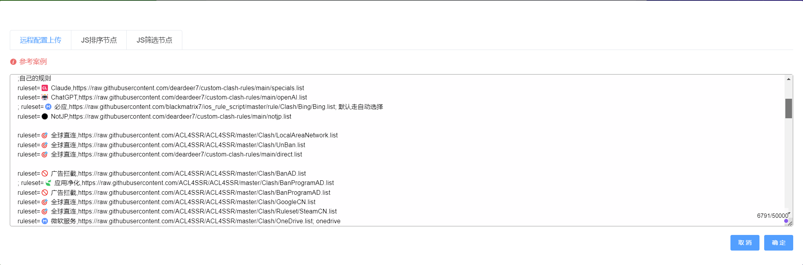
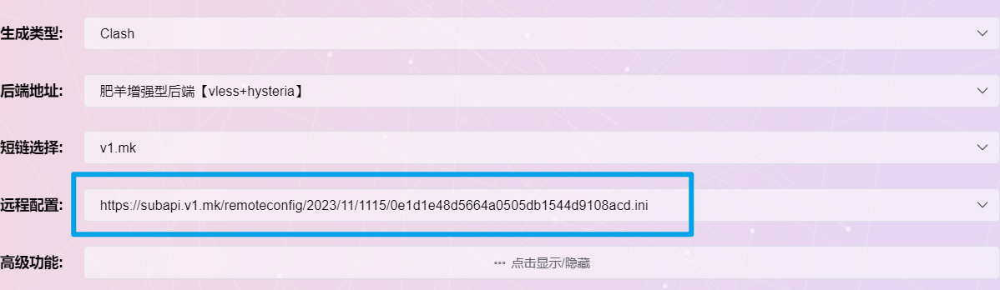

# Custom Clash Rule

## 介绍

聚合多✈订阅+自定义分流规则。

## 使用方法

<details>
<summary>ACL4SSR订阅转换</summary>

1. 以我常用的“[ACL4SSR在线订阅转换](https://acl4ssr-sub.github.io/)”为例
2. 点击“进阶模式”
3. 导入订阅链接（机场、自建的），参考我的机场：[机场测评](airport.md)
4. 远程配置把这个仓库里面的“.ini”结尾的文件填上去：
```text
https://raw.githubusercontent.com/deardeer7/custom-clash-rules/refs/heads/main/custom%20rules.ini
```
6. 转换导入clash即可~

</details>

<details>
<summary>肥羊订阅转换</summary>

1. 以[肥羊订阅转换](https://suburl.v1.mk/)为例，进入转换界面，填入订阅链接（机场或自建）参考我的机场：[机场测评](airport.md)
2. 点击`自定义配置`
3. 同时打开仓库里面的“.ini”结尾的文件[地址](https://raw.githubusercontent.com/deardeer7/custom-clash-rules/main/custom%20rules.ini)，复制**文件内容**，粘贴到`远程配置文件上传`页面中
4. 检查`远程配置`，如图则成功
5. 根据自己偏好配置其他选项，生成订阅链接（ps: 网站支持自定义短链接后缀）
6. 导入clash即可~~

</details>

[机场测评](airport.md)

[Flclash](https://github.com/chen08209/FlClash)：


## 注意

- 订阅转换后**导入**不成功时，可能是用的机场屏蔽了那个转换网站，可尝试换个转换网址。
- 订阅转换导入后，转换结果不对时，可能是生成类型有问题，可尝试选择 `自动判断客户端`。
- 订阅转换后，无法下载导入？
  - 尽量选择长链接，直接导入；
  - 可能是后端服务器挂了，尝试更换一个后端，重新转换。
- 订阅转换后，分组显示不对：远程地址填写有问题，重新尝试。

<details>
<summary>更新日志</summary>

2025/11/26 大版本更新，精简代理分组，聚合多订阅。

2025/11/25 存档[旧版本](https://github.com/deardeer7/custom-clash-rules/releases/tag/v1.5)。

2025/10/6 更新README。

2025/5/24 加入pubmed直连，更新README。

2024/5/18 重命名订阅类别为 `限量`和`限时`，注意节点分类规则仅仅适用于[我的机场](airport.md)。

2024/3/18 更新节点分组名称，如香港 -> 小香港，美国 -> 小美国等，其他节点分组名称不变。

2024/3/14 更新GPT节点规则，更新direct规则。

2023/12/27 调整md内容，目前发现肥羊订阅疑似存在：转换的订阅在更新时无法加载本仓库新加的rule，todo。

2023/11/17 更新：恢复bing分流。

2023/11/15 更新：ACL4SSR订阅转换疑似出现bug，自动更新后丢失自定义规则，更换订阅转换网站；针对魔戒GPT节点更新rule。

2023/9/14 更新：修复Claude AI规则。

2023/9/4 更新：新增Claude AI规则（分流到除HK外的proxies），其他更规则更新。

2023/6/26 更新：合并两个机场订阅定制，精简规则。
